# Automated Customer Case Routing System in Salesforce

This project focuses on the design and implementation of an automated Case Management system in Salesforce to streamline customer service operations and improve case resolution efficiency.

The solution automates case routing, assignment, and status tracking based on predefined business rules, reducing manual workload while improving visibility and response time across support operations.

# Executive Background

In many customer service environments, case handling is often managed manually or through inconsistent routing rules, leading to delayed response times, uneven workload distribution, and reduced customer satisfaction.

Without a structured case management system, support teams face challenges such as misrouted cases, lack of accountability, and limited visibility into case resolution progress.

This project demonstrates the implementation of an automated Case Management workflow in Salesforce designed to improve case routing efficiency, ensure proper assignment logic, and enhance service operations visibility.

## Business Objectives

- Automate case assignment and routing within Salesforce
- Reduce manual intervention in case distribution
- Improve response and resolution times for customer issues
- Ensure fair workload distribution across support agents
- Enhance visibility into case lifecycle and status tracking
- Standardize case handling processes across support operations
- Improve customer service efficiency and operational consistency

| Tool / Technology | Purpose |
|---|---|
| Salesforce Service Cloud | Core platform for case management implementation |
| Flow Builder | Automated Escalation for breached SLA |
| Assignment Rules | Defined case ownership based on conditions |
| Email-To-Case | Automated case creation from support email |
| Validation Rules | Ensured data integrity and case quality |
| Zapier / Asana | System Integration for high priotity case follow-up |
| Email Alerts | Automated notifications for case updates |
| Custom Fields & Objects | Captured case-related operational data |

## Workflow Logic

The case management workflow was designed to automatically route and assign customer cases based on predefined rules such as case Origin, and priority.

### Case Assignment Structure

| Case Type / Priority | Assignment Logic |
|---|---|
| Low/Mediom Priority | Assigned to Tabo Xm Support Service |
| High Priority | Assigned to senior support agent or team lead |

### Workflow Process

1. Customer case is created in Salesforce
2. System evaluates case type, priority, and category
3. Automatic Response is sent to customers for assurance of case management by service team
4. Assignment rules automatically route the case to the correct queue or agent
5. Notifications are sent to assigned users (tasks are assigned to asana through zapier for high priority cases are )
6. Case is tracked through resolution lifecycle
7. Escalation rules trigger if SLA thresholds are exceeded

## Automation Process Flow

The automation process ensures structured handling of customer cases from creation to resolution.

### Configurations Steps

1. Email-To-Case Enablement

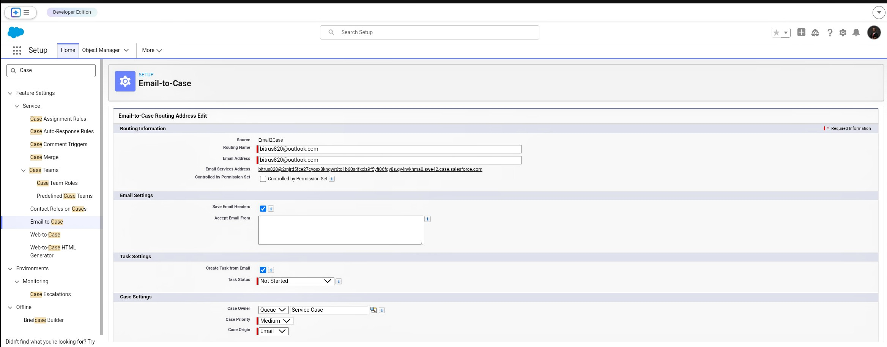

*This Image shows the dynamics behind connecting Tabo Xm support service to Salesforce. Default case settings is at Medium.*

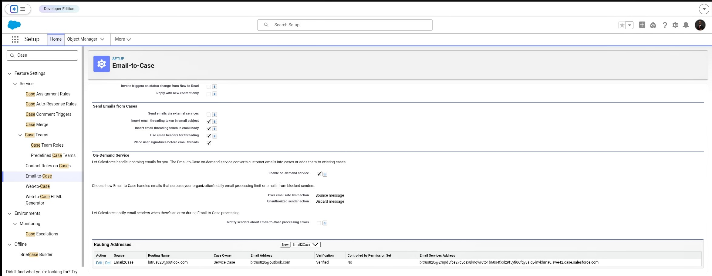

*This Image shows the Email address for Tabo Xm support service (bitrus820@outlook.com). Whenever a customer sends a mail to this address, a case is automatically created. canceling the issue of loss of cases.*

2. Case Routing/Assignment Rule Configuration

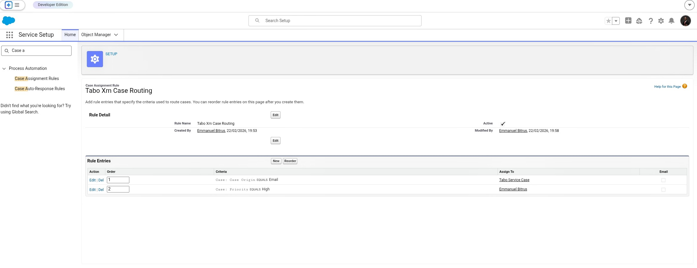
*In this image, cases from the service email are routwed to the service qeue, (Tabo Service Case). But every High priority case is assigned to a specific Service Rep.*

3. Auto-Response Rules/Email

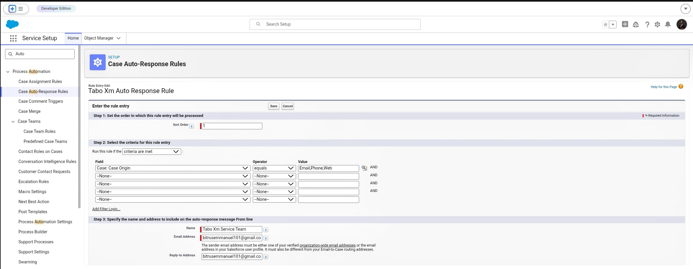
*This image shows how the automatic response from Tabo Xm Service Team is gorverned. Cases from all of Tabo Xm case origins are sent an email assurance.*

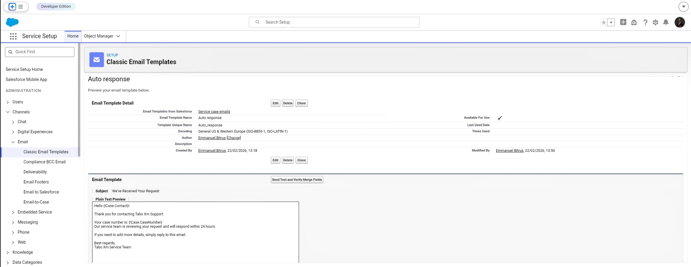
*In this image, we see thes the name of the account and the case number created.*

4. Sync Salesforce To Asana through Zapier Integration

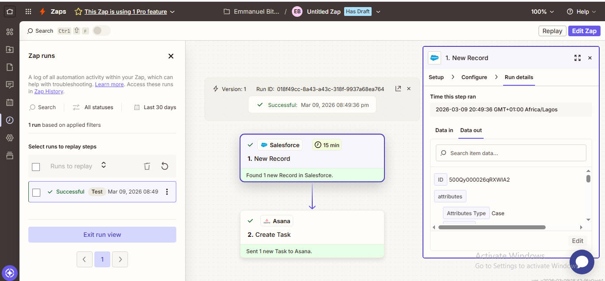
*Salesforce is linked to Asana, a project management tool, using Zapier Integration.*

### Process Stages

1. Case Creation

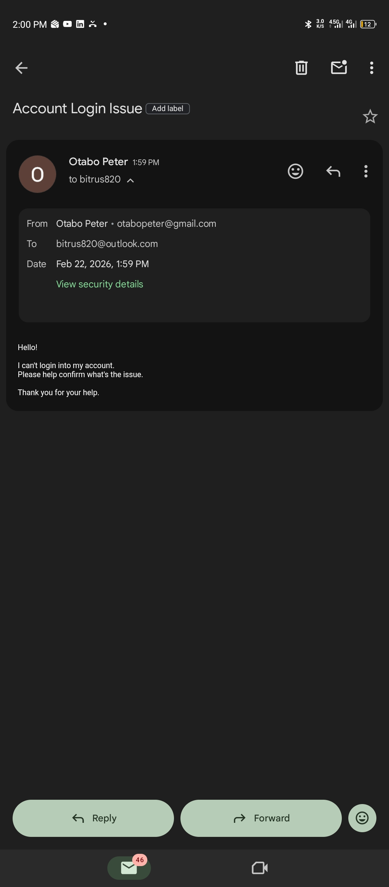
*This image captures the first stage of the case managment process, when a customer sends a concern to Tabo Xm Support Email.*

2. Automatic Response

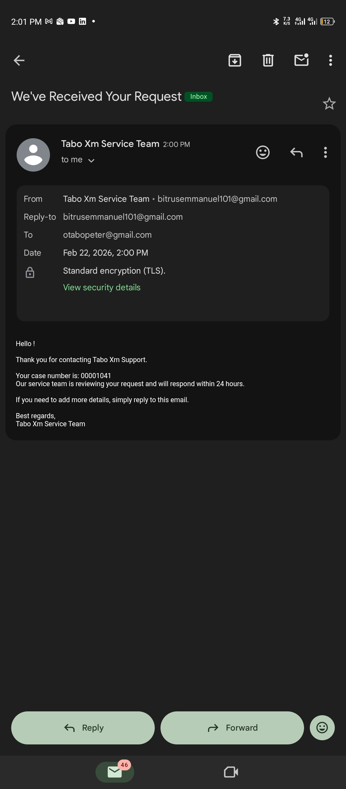
*An automatic response is sent to the customer to assure them that their case is being handled. (in this case this mail was sent by a non-customer of Tabo Xm, so the name of the account is not stated, just the case number).*

3. Email High Priority Cases To Asana

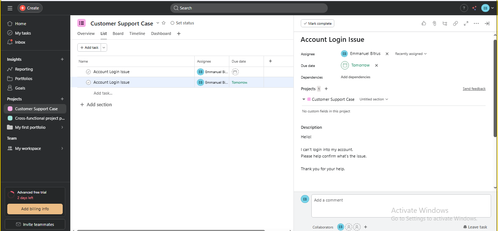
*Tasks are created in asana for Cases from emails with high priority for faster response time.*

4. Reporting Dashboard

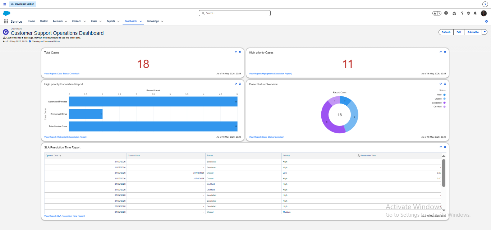
*Every case is tracked through this Dashboard in salesforce.*

### Workflow Diagram

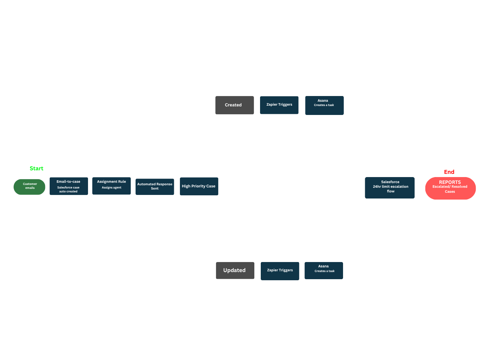

### Salesforce Flow Builder Preview

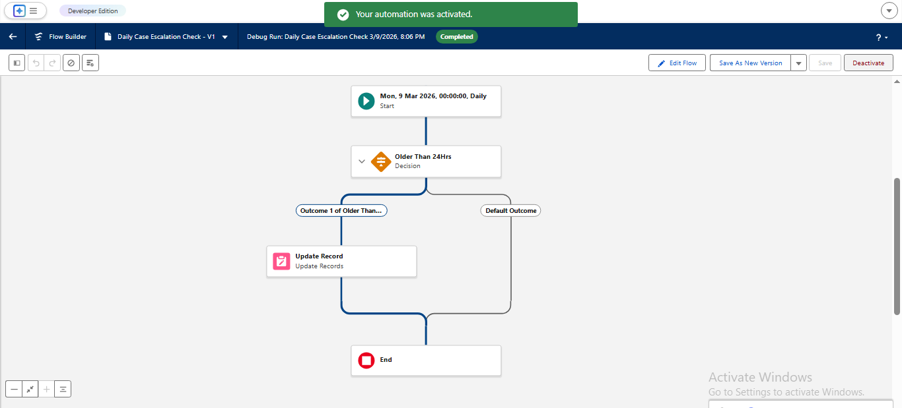

## Testing & Validation

The system was tested across multiple case scenarios to ensure correct routing, assignment accuracy, and escalation handling.

### Test Scenarios

| Scenario | Expected Outcome | Result |
|---|---|---|
| Low priority case creation | Assigned to general queue | Passed |
| High priority case | Routed to senior agent | Passed |
| Case reassignment | Updated correctly in system | Passed |
| Zapier Triggered | Asana Task | Passed

## Challenges & Solutions

| Challenge | Solution Implemented |
|---|---|
| Uneven case distribution across agents | Implemented automated assignment rules |
| Delayed case resolution tracking | Introduced SLA-based escalation rules |
| Manual case routing errors | Replaced with rule-based automation |
| Lack of visibility into case status | Enabled real-time status tracking |
| Inefficient escalation handling | Configured automated escalation workflows |

## Business Impact

- Improved case response and resolution times
- Reduced manual case assignment workload
- Enhanced customer service efficiency
- Increased visibility into case lifecycle
- Standardized support operations across teams
- Improved SLA compliance and escalation handling
- Optimized workload distribution among agents

## Future Improvements

- Integration with omnichannel support (chat, email, phone)
- AI-based case prioritization and routing
- Chatbot integration for automated case creation
- Advanced analytics on case resolution performance
- Machine learning-based workload balancing

---
*Part of the Emmanuel Bitrus Payments & Revenue Operations Portfolio*
*→ [Back to Portfolio](https://lorenferatacado.my.canva.site/bitrusemmanuel-salesops-portfolio)*

